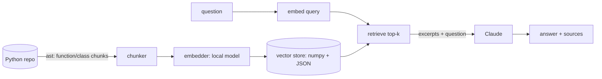

# CodeSage

[](https://github.com/sotream/CodeSage/actions/workflows/ci.yml)

A small, production-oriented RAG system for asking questions about a codebase —
not an agent, a retrieval pipeline with a clear boundary at each stage.

**Status: early / active development.** The pipeline (chunk → embed → store →
retrieve → answer) works end-to-end and is tested. Retrieval is measured on a
small fixed dataset (see [Evaluation](#evaluation)); it hasn't yet been run
against a large real-world repository.

## Why RAG, not an agent

The task — "answer a question about this codebase" — is a single retrieval +
generation step, not a multi-step decision process. An agentic loop (plan,
call tools, re-plan) adds latency, cost, and failure surface for a problem
that a direct retrieve-then-answer pipeline already solves. Agentic behavior
would earn its complexity only if the tool needed to, say, run the code or
chase cross-repository references — out of scope for v0.1.

## Architecture



```
chunker.py      splits Python files into function/class-level chunks (ast)
embedder.py     embeds chunks locally (sentence-transformers)
indexer.py      incremental update: re-embeds only files whose content hash changed
vector_store.py in-memory cosine-similarity index, JSON-persisted (atomic save)
qa.py           retrieves top-k chunks, asks Claude to answer using only them
evaluation.py   hit-rate@k and MRR over retrieval only (no LLM call)
cli.py          `codesage index <path>` / `codesage ask "<question>"` / `codesage eval <file>`
```

## Key trade-offs (and why)

- **Chunk by AST node, not fixed-length window.** A fixed window can slice a
  function mid-body, wasting embedding budget on an incomplete unit of logic.
  Parsing costs more up front; the chunks are semantically whole in return.
- **Local embeddings, not a hosted embeddings API.** Re-indexing runs
  potentially on every commit — avoiding a network round trip and a second
  API key per chunk was worth a larger one-time model download.
- **A numpy matrix, not a vector database.** For a single repo's worth of
  chunks (thousands, not millions), a full vector DB solves a scale problem
  this tool doesn't have (YAGNI). The store's interface (`add`, `search`,
  `save`, `load`) is deliberately small so swapping in pgvector/Chroma later
  doesn't ripple into the rest of the pipeline.
- **`asyncio` used only where it earns its keep.** File reads during chunking
  are I/O-bound and genuinely run concurrently via `asyncio.to_thread`.
  Embedding is CPU-bound — `asyncio` there only keeps the CLI responsive, not
  a real concurrency win, and the docstrings say so rather than implying
  otherwise.

## Known limitations

- Python-only chunking (the `ast` module is Python-specific). Adding a
  language means adding another chunker, not changing the pipeline.
- The evaluation is small: 33 questions over two small repositories, so one
  case is 3-6 points and differences of a few points are noise. It measures
  retrieval only, not answer quality ([ADR 0005](docs/adr/0005-retrieval-eval.md)).
- Incremental indexing works per file: a one-line edit re-embeds the whole file,
  a rename is re-embedded, and two `index` runs at once are not locked
  ([ADR 0006](docs/adr/0006-incremental-index.md)).

## Quick start

```bash
uv sync --all-extras
export CODESAGE_ANTHROPIC_API_KEY=...   # only needed for `ask`
uv run codesage index ./path/to/python/repo   # re-embeds only changed files; --full forces a rebuild
uv run codesage ask "Where is the retry logic?"
```

`index` prints what it did, for example after editing one file:

```
Files: 0 added, 1 changed, 0 removed, 9 unchanged
Chunks: 3 added, 2 removed, 58 unchanged
```

A different embedding model, a new chunker version or an older index format triggers a full
rebuild, and says why.

Settings (`CODESAGE_*` env vars or `.env`) are in `src/codesage/config.py`. Retrieved excerpts are sent
to the Anthropic API; see [SECURITY.md](SECURITY.md).

## Evaluation

`codesage eval` measures retrieval only: for each (question, expected file and function/class/method)
it checks where the expected chunk lands in the top 10 and reports hit@1, hit@3, hit@5 and MRR@10
(reciprocal rank, 0 beyond rank 10). No LLM call, so it is free, deterministic and needs no API key.
It is not part of CI (model download, time); the metrics code is unit-tested with a fake embedder.

**Datasets** (`eval/*.jsonl`, 33 questions, written from reading the source before any run):

- `eval/codesage.jsonl`, 15 questions about CodeSage itself, pinned to commit `d8633d5`. Not HEAD:
  this repository changes with every commit, and new code would compete in retrieval and move the
  numbers under a fixed dataset, so the corpus is the commit before this feature.
- `eval/humanize.jsonl`, 18 questions about [humanize](https://github.com/python-humanize/humanize)
  at commit `785e5dc` (MIT, `Copyright (c) 2010-2020 Jason Moiron and Contributors`). Fetched with
  `git archive` into a temporary directory outside this repo; it is not vendored and not a dependency.

Both are indexed from their `src/` directory. Tags: `direct` (question uses the code's own words),
`paraphrase` (it avoids them), `method`, `class`; tags overlap.

**Reproduce** (needs network for the repo and the one-time model download):

```bash
scripts/fetch_eval_repos.sh /tmp/codesage-eval
export CODESAGE_EMBEDDING_MODEL=all-MiniLM-L6-v2
uv run codesage index /tmp/codesage-eval/codesage/src --index-path /tmp/codesage-eval/codesage.index.json
uv run codesage index /tmp/codesage-eval/humanize/src --index-path /tmp/codesage-eval/humanize.index.json
uv run codesage eval eval/codesage.jsonl --index-path /tmp/codesage-eval/codesage.index.json --show-misses 50
uv run codesage eval eval/humanize.jsonl --index-path /tmp/codesage-eval/humanize.index.json --show-misses 50
```

**Results**, run on 2026-10-09 with `all-MiniLM-L6-v2` (I used a different temporary directory than
`/tmp/codesage-eval`; paths in the dataset are relative to `src/`, so the numbers do not depend on it).
Identical before and after the incremental-index change (same ranks, same scores).

| CodeSage @ d8633d5 | n | hit@1 | hit@3 | hit@5 | MRR@10 |
|---|---|---|---|---|---|
| overall | 15 | 0.733 | 0.933 | 1.000 | 0.836 |
| direct | 7 | 1.000 | 1.000 | 1.000 | 1.000 |
| paraphrase | 4 | 0.500 | 0.750 | 1.000 | 0.675 |
| method | 5 | 0.400 | 0.800 | 1.000 | 0.607 |
| class | 1 | 1.000 | 1.000 | 1.000 | 1.000 |

| humanize @ 785e5dc | n | hit@1 | hit@3 | hit@5 | MRR@10 |
|---|---|---|---|---|---|
| overall | 18 | 0.722 | 0.889 | 0.889 | 0.815 |
| direct | 7 | 0.857 | 0.857 | 0.857 | 0.881 |
| paraphrase | 11 | 0.636 | 0.909 | 0.909 | 0.773 |
| method | 1 | 0.000 | 0.000 | 0.000 | 0.000 |
| class | 1 | 0.000 | 1.000 | 1.000 | 0.500 |

Every question that did not rank first (the tool's full list, worst first):

| Dataset | Rank | Question | Expected | What ranked above |
|---|---|---|---|---|
| humanize | >10 | How are time units ordered so one can be compared as smaller than another? | `time.py:__lt__` | `_suppress_lower_units`, `precisedelta`, `naturaldelta` |
| humanize | 6 | How does naturaltime produce strings like 'an hour ago'? | `time.py:naturaltime` | `_now`, `_abs_timedelta`, `_date_and_delta` |
| codesage | 5 | What stable key identifies a piece of code in the index? | `models.py:chunk_id` | `cli.py:index`, `__init__`, `Settings` |
| codesage | 3 | What happens when the index file does not exist yet? | `vector_store.py:load` | `cli.py:index`, `vector_store.py:save` |
| humanize | 2 | Show 0.5 as a half and 1.25 as one and a quarter | `number.py:fractional` | `_rounding_by_fmt` |
| humanize | 2 | Spell out single-digit numbers as words, newspaper style | `number.py:apnumber` | `intword` |
| humanize | 2 | Which enumeration lists seconds, minutes, hours and days? | `time.py:Unit` | `precisedelta` |
| codesage | 2 | What reply is given when nothing relevant was found for the question? | `qa.py:generate_answer` | `__init__` |
| codesage | 2 | How is the index written to disk? | `vector_store.py:save` | `cli.py:index` |

What the misses suggest:

- Short, generic chunks win on vague questions: `cli.py:index` and the empty `__init__` outrank the
  right answer for "index" or "key" wording. A general-purpose text model matches words, and a tiny
  chunk has little else in it. Adding the file path or a docstring to the embedded text is the first
  thing to try.
- Tiny methods are weak spots: `__lt__` is three lines with no words in common with the question.
  `chunk_id` (a property) ranks 5th. Method questions have the lowest hit@1 on CodeSage.
- Public functions that delegate lose to the private helpers they call: `naturaltime` ranks 6th
  behind `_now` and `_date_and_delta`, which carry the vocabulary.
- Near misses (rank 2) are mostly siblings in the same module (`intword` for `apnumber`), which is
  the right file but the wrong function.
- Direct questions are solid (7/7 and 6/7 at hit@1). Paraphrase questions are where the model
  loses, as expected from a model not trained on code.

This is 33 questions: take these as a baseline to compare changes against, not as a benchmark.

## Decisions

- [0001 AST chunking](docs/adr/0001-ast-chunking.md)
- [0002 In-memory numpy index](docs/adr/0002-numpy-vector-store.md)
- [0003 Local embeddings](docs/adr/0003-local-embeddings.md)
- [0004 Pipeline, not agent](docs/adr/0004-rag-not-agent.md)
- [0005 Retrieval eval: hit-rate and MRR](docs/adr/0005-retrieval-eval.md)
- [0006 Incremental index by file hash](docs/adr/0006-incremental-index.md)

## Roadmap

- [ ] Non-Python chunkers (tree-sitter).

## Development

```bash
uv sync --all-extras
uv run pytest
uv run ruff check .
uv run mypy src
```

## About this project

A personal project, shared as is, with no warranty or support. Built with Claude Code; I made the design
decisions and reviewed and tested the code. The reasoning is in the [ADRs](docs/adr).

## License

[MIT](LICENSE)
