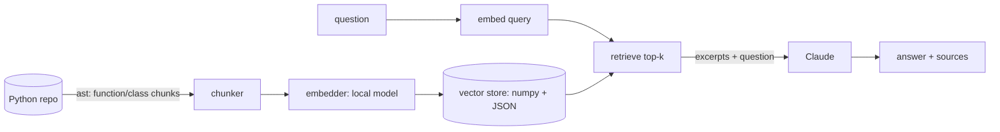

# CodeSage

[](https://github.com/sotream/CodeSage/actions/workflows/ci.yml)

A small, production-oriented RAG system for asking questions about a codebase —
not an agent, a retrieval pipeline with a clear boundary at each stage.

**Status: early / active development.** The pipeline (chunk → embed → store →
retrieve → answer) works end-to-end and is tested; it hasn't yet been run
against a large real-world repository, and the retrieval quality hasn't been
evaluated beyond spot checks.

## Why RAG, not an agent

The task — "answer a question about this codebase" — is a single retrieval +
generation step, not a multi-step decision process. An agentic loop (plan,
call tools, re-plan) adds latency, cost, and failure surface for a problem
that a direct retrieve-then-answer pipeline already solves. Agentic behavior
would earn its complexity only if the tool needed to, say, run the code or
chase cross-repository references — out of scope for v0.1.

## Architecture



```
chunker.py      splits Python files into function/class-level chunks (ast)
embedder.py     embeds chunks locally (sentence-transformers)
vector_store.py in-memory cosine-similarity index, JSON-persisted
qa.py           retrieves top-k chunks, asks Claude to answer using only them
cli.py          `codesage index <path>` / `codesage ask "<question>"`
```

## Key trade-offs (and why)

- **Chunk by AST node, not fixed-length window.** A fixed window can slice a
  function mid-body, wasting embedding budget on an incomplete unit of logic.
  Parsing costs more up front; the chunks are semantically whole in return.
- **Local embeddings, not a hosted embeddings API.** Re-indexing runs
  potentially on every commit — avoiding a network round trip and a second
  API key per chunk was worth a larger one-time model download.
- **A numpy matrix, not a vector database.** For a single repo's worth of
  chunks (thousands, not millions), a full vector DB solves a scale problem
  this tool doesn't have (YAGNI). The store's interface (`add`, `search`,
  `save`, `load`) is deliberately small so swapping in pgvector/Chroma later
  doesn't ripple into the rest of the pipeline.
- **`asyncio` used only where it earns its keep.** File reads during chunking
  are I/O-bound and genuinely run concurrently via `asyncio.to_thread`.
  Embedding is CPU-bound — `asyncio` there only keeps the CLI responsive, not
  a real concurrency win, and the docstrings say so rather than implying
  otherwise.

## Known limitations

- Python-only chunking (the `ast` module is Python-specific). Adding a
  language means adding another chunker, not changing the pipeline.
- No incremental indexing yet — `index` re-embeds the whole repository every
  run. Fine at current scale; the first thing to fix before using this on a
  large, frequently-changing codebase.
- Retrieval quality is unverified beyond unit tests of the mechanics
  (nearest-neighbor ranking, persistence). No evaluation set yet.

## Quick start

```bash
uv sync --all-extras
export CODESAGE_ANTHROPIC_API_KEY=...   # only needed for `ask`
uv run codesage index ./path/to/python/repo
uv run codesage ask "Where is the retry logic?"
```

Settings (`CODESAGE_*` env vars or `.env`) are in `src/codesage/config.py`. Retrieved excerpts are sent
to the Anthropic API; see [SECURITY.md](SECURITY.md).

## Decisions

- [0001 AST chunking](docs/adr/0001-ast-chunking.md)
- [0002 In-memory numpy index](docs/adr/0002-numpy-vector-store.md)
- [0003 Local embeddings](docs/adr/0003-local-embeddings.md)
- [0004 Pipeline, not agent](docs/adr/0004-rag-not-agent.md)

## Roadmap

- [ ] Evaluation set (question, expected file/function) with hit-rate@k, to measure retrieval changes.
- [ ] Incremental indexing keyed by file hash.
- [ ] Non-Python chunkers (tree-sitter).

## Development

```bash
uv sync --all-extras
uv run pytest
uv run ruff check .
```

## About this project

A personal project, shared as is, with no warranty or support. Built with Claude Code; I made the design
decisions and reviewed and tested the code. The reasoning is in the [ADRs](docs/adr).

## License

[MIT](LICENSE)
